## Building an Async Runtime in Rust with `io_uring`

---
## `whoami`

- [Malthe Mølgaard Larsen](https://www.linkedin.com/in/malthe-m-larsen/)
- [MLFlexer](https://github.com/MLFlexer)
- Background
  - BSc @ ITU
  - MSc @ UCPH
  - Starting a PhD @ DIKU developing an open, RISC-V based, EU-produced, storage accelerator, [CHORYS](https://chorys.eu/)
  - Wezterm plugin creator: resurrect, smart workspace switcher, modal keybindings
  - Rust, Nix and Helix enjoyer
  - Love everything systems programming/high performance

---
## Motivation
- Bored after finishing MSc thesis
- Wanted to learn `io_uring`
- Initial idea was to make a zero-copy HTTPS server with `io_uring` + `kTLS`

---
## Motivation
Made a single threaded MVP doing the TLS handshake through `io_uring` was able to send HTTPS requests to a client through `io_uring`.
But the code was ugly and multithreading made it even uglier...

---
## Motivation
- Bored after finishing MSc thesis
- Wanted to learn `io_uring`
- ~~Initial idea was to make a zero-copy HTTPS server with `io_uring` + `kTLS`~~
- Learn async Rust by build an runtime for `io_uring`

---
## TLDR: `io_uring`
- Syscalls can be expensive
  - Userspace -> Kernel
  - Context switching
  - Blocking

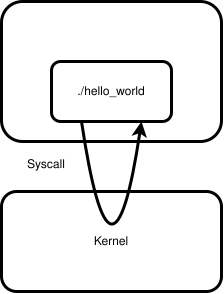

---

## TLDR: `io_uring`
- Ring-buffer pair shared with kernel
- Atomically interact with buffers
  - avoids context switching
- Submit SQEs to submission queue (SQ)
- Submissions complete *asynchronously*
  - avoids blocking
- Get CQEs from completion queue (CQ)
- Entries have 64 bits for user data

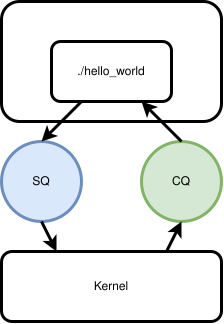

---
## TLDR: `io_uring`
- Created by Jens Axboe


---
## TLDR: `io_uring`
- Created by Jens Axboe
- Danish BTW 🇩🇰


---
## So what is async Rust?
- `async` keyword allows us to call `.await`
- `.await` tells us that the code will complete asynchrynously
- Enables writing async code in a sync-style
- Can speedup certain tasks like I/O bound workloads

---
## Compiler Magic
- The compiler transforms this:

```rs
async {
    // ... before f
    f().await;
    // ... after f
}
```


---

## High-level Intermediate Representation (HIR)

```rs
async {
    // ... before f
    f().await;
    // ... after f
}


|mut _task_context: ResumeTy|
{
    // ... before f
    match #[lang = "into_future"](f()) {
        mut __awaitee =>
            loop {
                match unsafe {
                        // Calls poll
                        #[lang = "poll"](#[lang = "new_unchecked"](&mut __awaitee),
                            #[lang = "get_context"](_task_context))
                    } {
                    // Break if ready
                    #[lang = "Ready"] {  0: result } => break result,
                    #[lang = "Pending"] {} => { }
                }
                // Yield if pending
                _task_context = (yield ());
            },
    };
    // ... after f
}
```


---
## So WTF is async Rust actually?
- `async`-keyword creates `Futures`
- The `Future` trait can be implemented custom types
- Calling `.await` on a future, *polls* the future
- Polling a future will result in the future being *ready* or *pending*
  - Ready futures will continue execution
  - Pending futures will yield the current execution to the runtime
- Runtime can *wake* a future to *poll* it again

---
## How do we combine `io_uring` and async Rust?

---

## High Level Idea
- Initial poll submits SQEs to `io_uring` and yield execution.
- When submissions complete, then we *wake* and *poll* again.

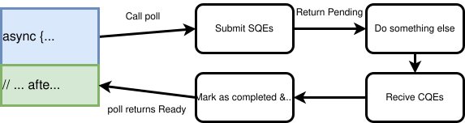

---

## What does the runtime do then?
1. Recive SQEs from MPSC channel
2. Submit SQEs to `io_uring`
3. Check for CQEs
4. Handle CQEs

---

## What does the runtime do then?
```rs
while let Ok(sqes_w_state) = sqe_rx.try_recv() {
    ring.submission().push(sqes_w_state.get_sqes());
    // Map the id/userdata with the state
    map.insert(sqes_w_state.get_id(), sqes_w_state);
}

ring.submit();

for cqe in ring.completion() {
    // Map the id/userdata with the state
    let state = map.get(cqe.user_data());
    state.handle_cqe(cqe);
    if state.is_complete() {
      state.wake(); // We'll come back to this
    }
}
```
---

## What about multithreading?
- Make a thread pool
- Each thread loops the following:
  1. Recive future from MPMC *task* channel and `poll()` it
  2. If no futures are left in channel, then handle `io_uring` submissions and completions
  3. Repeat
- To spawn a task, we can just send it to the *task* channel
- Waking a future is the same thing, the `wake()` just reenters the future into the task channel

---
## Overview

- Concurrent execution of tasks
- Single `io_uring` behind Mutex
- Channels for send/recv tasks and SQEs
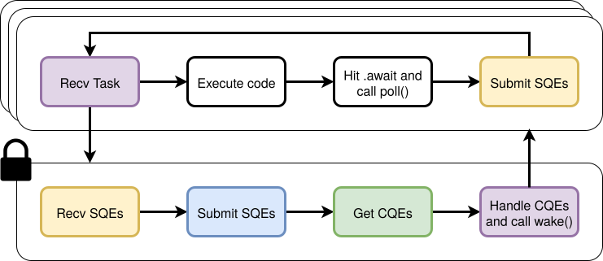

---
## Write example:
```rs
spawn(async {
    let hello = "Hello from io_uring!\n";
    WriterFuture::new(hello, 0).await;
});
```
---

```rs
pub struct WriterFuture<T: AsRef<[u8]>> {
    shared_state: Arc<AtomicSharedCell<SharedState<T>>>,
    fd: i32,
}

struct SharedState<T: AsRef<[u8]>> {
    buf: T,
    id: OnceCell<u64>,
    sqes: OnceCell<[squeue::Entry; 1]>,
    cqes: OnceCell<cqueue::Entry>,
    waker: AtomicWaker,
}
```
---

```rs
impl<T: AsRef<[u8]> + 'static> Future for WriterFuture<T> {
    type Output = i32;
    fn poll(self: Pin<&mut Self>, cx: &mut Context<'_>) -> Poll<Self::Output> {
        let res = self.shared_state.with_inner(|shared_state| {
            match shared_state.cqes.get() {
                None => {
                    shared_state.waker.register(cx.waker());

                    let id = get_id();
                    shared_state.id.set(id);

                    let buf: &[u8] = shared_state.buf.as_ref();
                    let write_e =
                        opcode::Write::new(types::Fd(self.fd), buf.as_ptr(), buf.len() as u32)
                            .build()
                            .user_data(id);
                    shared_state.sqes.set([write_e]);

                    return Poll::Pending;
                }
                Some(cqe) => return Poll::Ready(cqe.result()),
            };
        });

        if res.is_pending() {
            SQE_SENDER.send(self.shared_state.clone());
        }
        return res;
    }
}
```

---
## It Works!
```rs
spawn(async {
    let hello = "Hello from io_uring!\n";
    WriterFuture::new(hello, 0).await;
});
```

```sh
Hello from io_uring!
```

---
## Walkthrough


---
## Walkthrough
A thread recives a task.

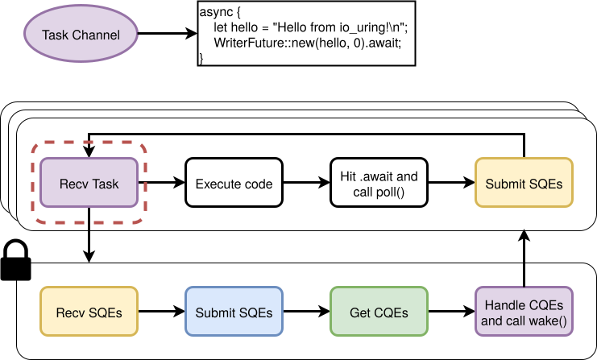

---
## Walkthrough
It executes code by calling `poll()`.

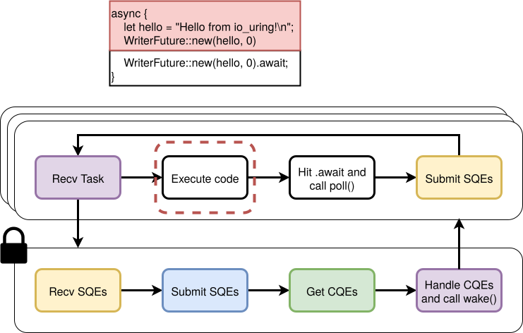

---
## Walkthrough
It hits a `.await` and calls `poll()` on the future.

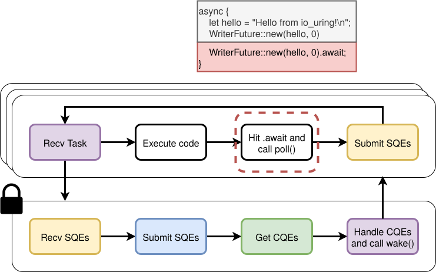

---
## Walkthrough
`poll` submits the write SQE with state to SQE channel.

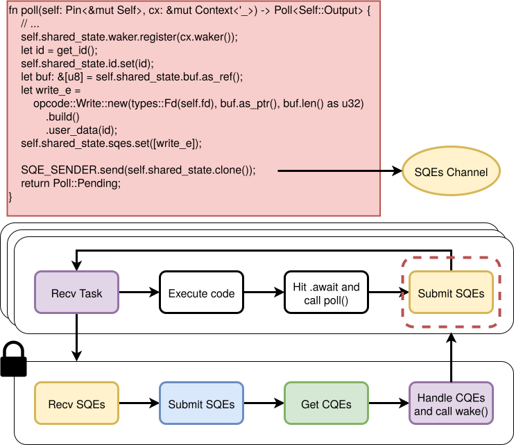

---
## Walkthrough
Threads continue to recive tasks - execute code while SQEs can be handled.

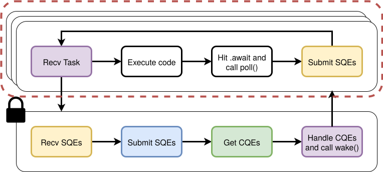

---
## Walkthrough
Eventually a thread will handle `io_uring` by reciving from SQE channel.

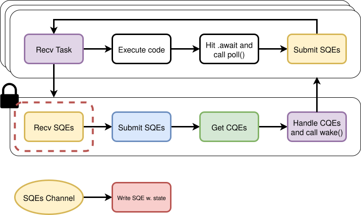

---
## Walkthrough
The write SQE is retrived and submitted to submission queue.

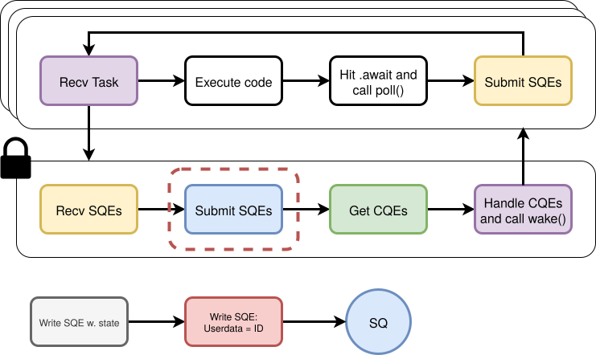

---
## Walkthrough
It sits in the submission queue until the kernel handles it.
In the mean time other work can be done.

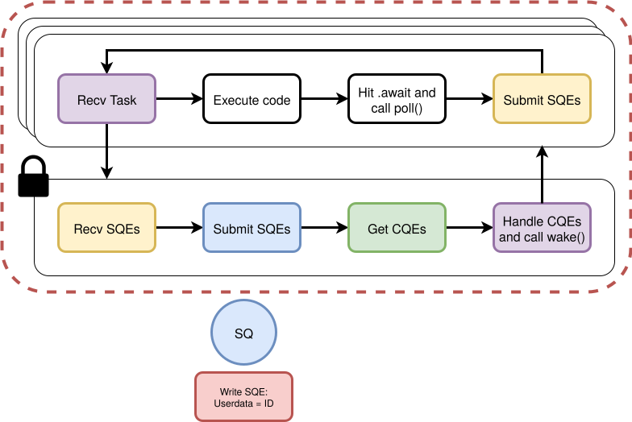

---
## Walkthrough
Eventually it ends up in the completion queue with the result.

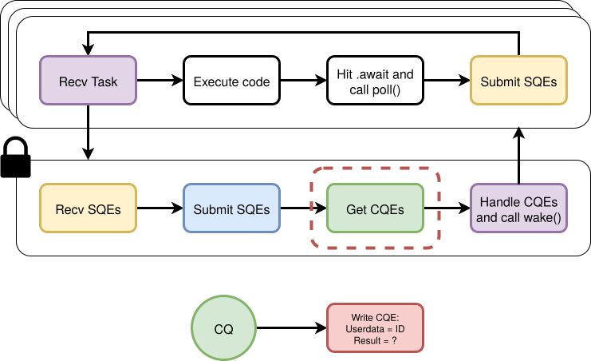

---
## Walkthrough
The CQE is associated with the state and `wake()` sends it to the task channel.

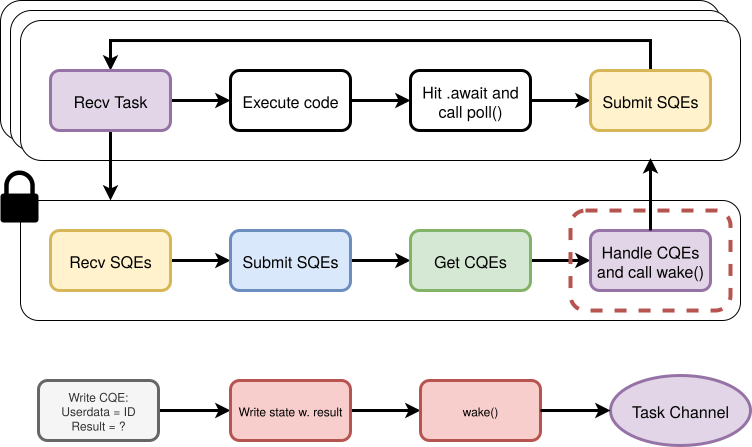

---
## Walkthrough
Recive other tasks


---
## Cool, but can we do more than hello world?

---
## HTTP server
- Listen for incomming connections
- Accept connections
- Read request from socket
- Write response to socket
- Shutdown and close connection

---
## `io_uring` Multishot
- Multishot operations can return multiple CQEs on a single SQE
- Multishot accept -> A CQE per connection
- Multishot recive -> A CQE per message

---
## `io_uring` Linking
- SQEs can be linked to complete in a sequence
- If one fails, then the rest are cancelled

---
## HTTP server
- Listen for incomming connections
- *Multishot Accept connections*
- Read request from socket
- Write response to socket
- *Linked shutdown and close connection*

---
## HTTP server
```rs
spawn(async {
    // Listen for incomming connections
    let addr: SocketAddr = "192.168.0.42:8080".parse().unwrap();
    let listener = TcpListener::bind(addr).unwrap();
    // Accept connections
    let _ = AcceptMultiFuture::new(listener.as_raw_fd(), |fd| async move {
        // Read from socket
        let buf: [u8; 128] = [0u8; 128];
        let _ = ReaderFuture::new(buf, fd).await;
        // Write to socket
        let response = "HTTP/1.1 200 OK\r\nContent-Length: 13\r\nConnection: close\r\n\r\nHello, World!";
        let _ = WriterFuture::new(response, fd).await;
        // Shutdown and close connection
        let _ = ShutdownAndCloseFuture::new(fd).await;
    })
    .await;
});
```

---
# Okay, but is it :fire: blazingly :fire: fast?

---
## Tokio implementation
```rs
async fn accept_test() -> std::io::Result<()> {
    let addr = "192.168.0.8:8080";
    let listener = TcpListener::bind(addr).await?;
    loop {
        let (mut socket, _) = listener.accept().await?;
        tokio::spawn(async move {
            let mut buf = [0u8; 128];
            match socket.read(&mut buf).await {
                Ok(0) => return, // connection closed
                Ok(_) => {
                    let response = b"HTTP/1.1 200 OK\r\nContent-Length: 13\r\nConnection: close\r\n\r\nHello, World!";

                    let _ = socket.write_all(response).await;
                }
                Err(_) => return,
            }
        });
    }
}
```


---
## Benchmark setup
Server:
- Ryzen 5 5600X 6-Core
- 16 GB RAM
- Kernel: 6.12.33
- Ethernet

Client:
- Ryzen 5 4500U 6-Core
- Wifi
- `hey -z 5m -cpus 6 -c $NUM_CONNECTIONS $ADDRESS`


---
## Benchmark setup
- 5 minute load
- 4 vs. 6 threads
- 100 vs. 1000 connections
- Tokio vs. uring vs. uring + sqpoll

---
## SQ Polling
- A kernel thread continuously polls the submission queue for submissions
- Pay CPU for faster completions

---
## Reqests per Second
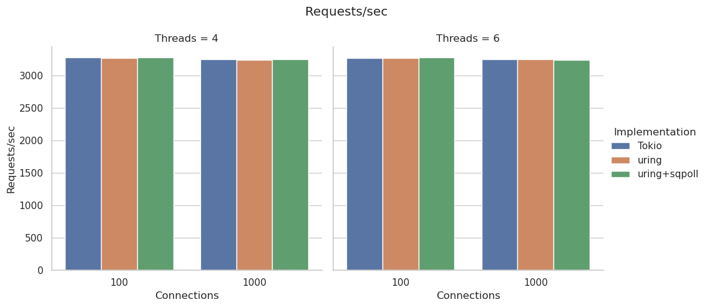

---
## Average Latency
.png)


---
## 99% Latency
.png)

---
## Cheating HTTP server (Linked read, write and close)
```rs
spawn(async {
    // Listen for incomming connections
    let addr: SocketAddr = "192.168.0.42:8080".parse().unwrap();
    let listener = TcpListener::bind(addr).unwrap();
    // Accept connections
    let _ = AcceptMultiFuture::new(listener.as_raw_fd(), |fd| async move {
        let buf: [u8; 128] = [0u8; 128];
        let response = "HTTP/1.1 200 OK\r\nContent-Length: 13\r\nConnection: close\r\n\r\nHello, World!";
        // read, write and close
        let _ = RWCFuture::new(buf, response, fd).await;
    })
    .await;
});

```
---
## Reqests per Second
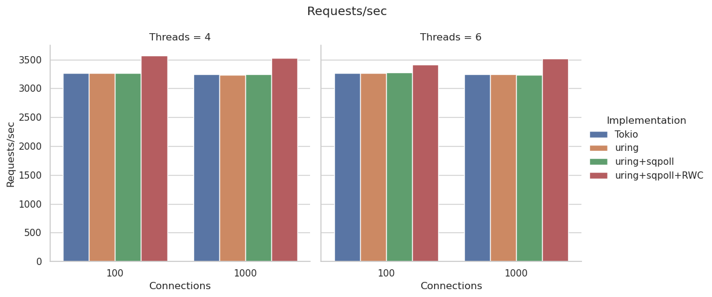

---
## Average Latency
_RWC.png)

---
## 99% Latency
_RWC.png)

---
## Performance Improvements
- Improved contention on locks and channels
- Local and Global queues
- Multiple rings
- Reduced/Improved allocation
- Implement all operations
- Better API
- Handle errors and cancelations

---
## Use after `drop()`
1. submit SQE
2. `drop()`
3. Kernel uses dropped data.
4. ~~profit~~ Undefined behaviour 💀

---
## Use after `drop()`
- Can happen if futures are cancelled.
- `select!` returns the first future to finish.
```rs
select! {
    msg1 = rx1.recv() => println!("received msg1: {}", msg1.unwrap()),
    msg2 = rx2.recv() => println!("received msg2: {}", msg2.unwrap()),
}
```


---
## Use after `drop()`
- Ensure data isn't dropped before all CQEs are seen
- When dropping
    1. check if complete or
    2. issue cancellation SQE and await CQE


---
## Use after `drop()`
- Data used by SQEs is owned until complete
- Ready futures can return ownership
```rs
spawn(async {
    let hello = "Hello from io_uring!\n";
    let (res, hello) = WriterFuture::new(hello, 0).await;
    // ... Reuse hello buffer
});
```

---
## Tokio-uring
Tokio is in the process of implementing a backend for `io_uring` with [tokio-uring](https://github.com/tokio-rs/tokio-uring).

---
## Takeaways
- Building an async runtime is easier than you would expect in Rust
- Great project for learning internals of async Rust
- `io_uring` is kinda cool

---
# Thanks for comming to my first talk! :smile:

---
# And thanks to the organizers and our host!

---
# Questions?
Code/presentation available here:
[github.com/MLFlexer/async_runtime_io_uring_presentation](https://github.com/MLFlexer/async_runtime_io_uring_presentation/)
